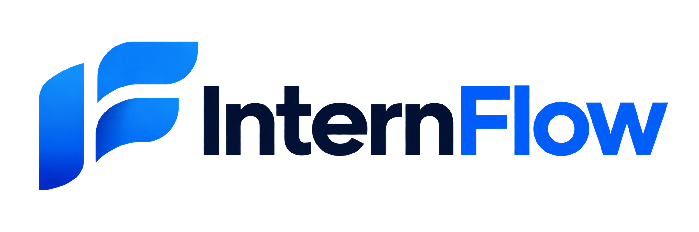

<p align="center">
  
</p>

<h1 align="center">Kerja tercatat. Bukti tertata. Laporan siap.</h1>

<p align="center">
  InternFlow menyatukan aktivitas, Todo, bukti pekerjaan, kalender, dan laporan Excel
  untuk kegiatan magang, tugas akhir, serta pekerjaan personal.
</p>

<p align="center">
  <strong>Magang</strong> · <strong>Tugas Akhir</strong> · <strong>Personal</strong>
</p>

---

## 💡 Dari masalah ke solusi

| Yang sering terjadi | Cara InternFlow membantu |
| --- | --- |
| 📝 Kegiatan baru dicatat menjelang tenggat laporan | Catat Activity langsung dari ponsel, bahkan tanpa membuat Todo. |
| 📷 Foto menumpuk di perangkat dan sulit ditemukan | Simpan foto di Evidence Library berbasis Google Drive privat, lalu lampirkan kembali saat dibutuhkan. |
| 🧩 Tugas, progres, dan pekerjaan yang selesai tersebar | Kelola Todo melalui Kanban atau List; lihat riwayat kerja di kalender. |
| 📊 Logbook dan lampiran harus dirapikan ulang secara manual | Pilih periode dan kategori, lalu unduh Excel dengan tautan bukti yang relevan. |

## 🧭 Alur kerja

**Pilih kategori** → **catat Activity atau buat Todo** → **lampirkan bukti bila diperlukan** → **tinjau kalender dan logbook** → **ekspor laporan**.

Activity dapat dibuat tanpa Todo. Todo **Magang** dan **Tugas Akhir** memerlukan evidence yang tersedia sebelum masuk tahap Review atau Done; saat selesai, Todo dapat dicatat otomatis sebagai Activity. Todo **Personal** tidak memerlukan evidence dan tetap muncul dalam riwayat pekerjaan tanpa bercampur dengan logbook magang.

## ✨ Fitur utama

| Area | Yang bisa dilakukan |
| --- | --- |
| 🏠 **Beranda** | Akses cepat ke pencatatan, upload, Todo, laporan, dan area lain dari ponsel. |
| ✅ **Todo** | Pindahkan pekerjaan di Kanban, gunakan tampilan List pada layar kecil, dan pantau progres per kategori. |
| ✍️ **Activity** | Catat pekerjaan langsung atau dari Todo yang selesai, lalu tambahkan bukti sesuai kebutuhan. |
| 📎 **Evidence** | Unggah foto, simpan tautan, dan pilih commit GitHub secara eksplisit sebagai bukti. |
| 📅 **Kalender & Logbook** | Tinjau pekerjaan yang selesai dan susun catatan harian. |
| 📊 **Laporan** | Ekspor Excel per kategori dan periode, dengan tautan foto yang dapat dibagikan secara terbatas. |
| 🔗 **Integrasi** | Hubungkan GitHub jika diperlukan; fitur utama tetap berjalan tanpanya. |
| 🔐 **Admin** | Pemilik yang ditetapkan dapat menambahkan pengguna dari dashboard. |

## 🖼️ Sekilas tampilan

| Beranda mobile | Kanban desktop |
| :---: | :---: |
|  |  |

## 🚀 Menjalankan di lokal

Gunakan Node.js **22.22.2+**, **24.15+**, atau **26+**. Setelah repository di-clone:

```powershell
npm ci
Copy-Item .env.example .env.local
npm run dev
```

Buka **http://localhost:3000**. Pada macOS/Linux, ganti `Copy-Item` dengan `cp`. Isi `.env.local` sebelum memakai fitur yang memerlukan layanan eksternal; file ini sudah diabaikan Git.

| Konfigurasi | Kegunaan |
| --- | --- |
| `NEXT_PUBLIC_SUPABASE_URL`, `NEXT_PUBLIC_SUPABASE_ANON_KEY` | Koneksi database dan login Supabase. |
| `SUPABASE_SERVICE_ROLE_KEY` | Operasi server tepercaya, termasuk pengelolaan pengguna dan tautan foto laporan. Jangan gunakan awalan `NEXT_PUBLIC_`. |
| `GOOGLE_*`, `EVIDENCE_RECONCILE_SECRET` | Upload, pembacaan, dan rekonsiliasi foto privat. |
| `APP_BASE_URL` | Asal URL pada tautan laporan dan callback integrasi. |
| `GITHUB_*` | OAuth dan sinkronisasi commit; opsional. |

> **Rahasia tetap di server.** Jangan commit `.env.local`, menaruh credential di variabel `NEXT_PUBLIC_*`, atau membagikannya melalui issue dan screenshot.

<details>
<summary><strong>📷 Menyiapkan Google Drive</strong></summary>

1. Aktifkan Google Drive API pada Google Cloud dan siapkan OAuth client **Web application** dengan redirect URI `http://127.0.0.1:8765/callback`.
2. Buat folder evidence dengan akses **Dibatasi**. Isi `GOOGLE_CLIENT_ID`, `GOOGLE_CLIENT_SECRET`, dan `GOOGLE_DRIVE_ROOT_FOLDER_ID` di `.env.local`.
3. Jalankan `npm run google:setup`. Helper memverifikasi akses folder dan menyimpan `GOOGLE_REFRESH_TOKEN` ke `.env.local`. Setelah itu, restart server.
4. Isi `EVIDENCE_RECONCILE_SECRET` dengan nilai acak minimal 32 karakter. Endpoint `POST /api/internal/evidence-reconcile` hanya boleh dipanggil dari lingkungan tepercaya.

Aplikasi menggunakan OAuth akun penyimpanan pada server; koneksi Google Drive milik alat pengembangan tidak otomatis menjadi credential aplikasi. Scope `drive` memberi akses luas, jadi gunakan akun penyimpanan khusus bila memungkinkan. Untuk consent screen **External/Testing**, refresh token dapat kedaluwarsa setelah tujuh hari. Lihat [panduan OAuth Google](https://developers.google.com/identity/protocols/oauth2) dan [scope Drive](https://developers.google.com/workspace/drive/api/guides/api-specific-auth).

</details>

<details>
<summary><strong>🔗 Menyiapkan GitHub (opsional)</strong></summary>

Isi `GITHUB_CLIENT_ID`, `GITHUB_CLIENT_SECRET`, dan `GITHUB_CALLBACK_URL`. Callback harus persis `<APP_BASE_URL>/api/integrations/github/callback` dengan origin yang sama. Buat `GITHUB_TOKEN_ENCRYPTION_KEY` berupa 32 byte/64 karakter hex:

```powershell
node -e "console.log(require('node:crypto').randomBytes(32).toString('hex'))"
```

Simpan kunci tersebut di environment server dan pertahankan antar-deployment; menggantinya memerlukan migrasi token atau pengguna menghubungkan ulang akun. Pengguna memilih commit sebelum menjadi evidence. Disconnect menghapus token aplikasi tanpa menghapus evidence historis. Akses repository privat memerlukan scope GitHub `repo` yang luas, sehingga hanya aktifkan bila dibutuhkan.

</details>

## 📊 Tautan foto untuk dosen

Saat mengekspor laporan, **akses foto default bersifat privat**. Jika dosen perlu membuka foto tanpa akun InternFlow:

1. Di **Laporan**, pilih kategori dan periode, lalu aktifkan **Bagikan ke dosen**.
2. Pilih masa berlaku **30, 90, atau 180 hari**, kemudian unduh Excel.
3. Tautan **Buka foto** pada sheet **Logbook** dan **Evidence Detail** hanya berlaku untuk foto yang masuk dalam ekspor itu.
4. Hentikan akses kapan saja dari daftar **Akses foto aktif** di halaman Laporan.

Foto tetap berada di Drive privat. Pemegang file Excel dapat membuka foto yang dibagikan selama tautannya aktif, jadi kirim file hanya kepada penerima yang dituju.

> **Akses dari perangkat dosen memerlukan situs HTTPS publik.** Atur `APP_BASE_URL` ke alamat publik **sebelum** mengekspor. Excel yang dibuat saat URL masih `http://localhost:3000` harus diekspor ulang setelah situs dipublikasikan.

## 🛡️ Privasi dan aturan data

- Aktivitas, Todo, dan evidence dibatasi per pemilik melalui aturan akses database.
- Bukti akademik harus tersedia sebelum pekerjaan melewati tahap yang mensyaratkannya.
- GitHub adalah integrasi pilihan; commit tidak otomatis berubah menjadi Activity.
- Tautan foto laporan memiliki masa berlaku, dapat dicabut, dan tidak membuat folder Drive menjadi publik.

## 🧪 Pemeriksaan proyek

```powershell
npm run lint
npm run typecheck
npm test
npm run build
```

Migrasi database tersimpan berurutan di `supabase/migrations/`. Jangan jalankan ulang migrasi yang sudah tercatat di cloud. Regresi SQL berada di `supabase/tests/`; pengujian pada database yang sudah ada tidak menggantikan replay migrasi dari database kosong.

**Stack:** Next.js 16 · React 19 · TypeScript · Tailwind CSS 4 · Supabase · Google Drive API · ExcelJS · Vitest.

---

📚 **Rujukan:** [PRD dan aturan produk](PRD_Internship_Activity_Evidence_Logbook_System_v1.1.md) · [Catatan implementasi dan QA](docs/WORKSPACE_V2_DELIVERY.md)
