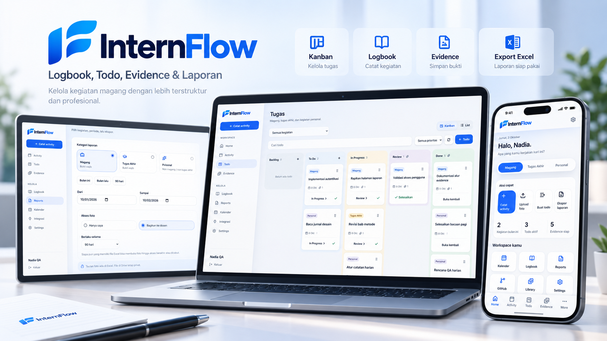
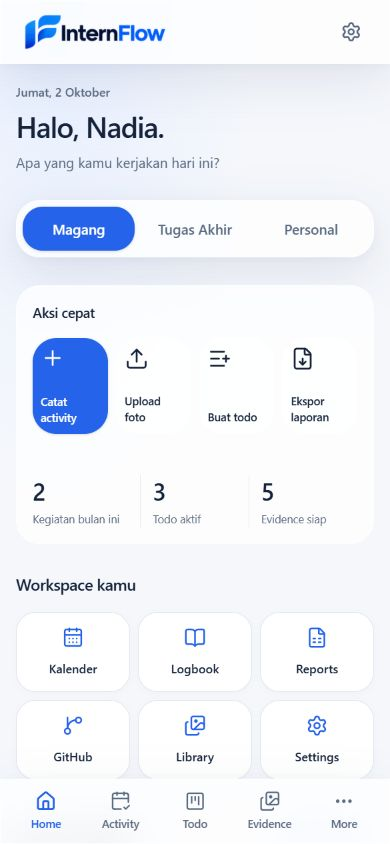
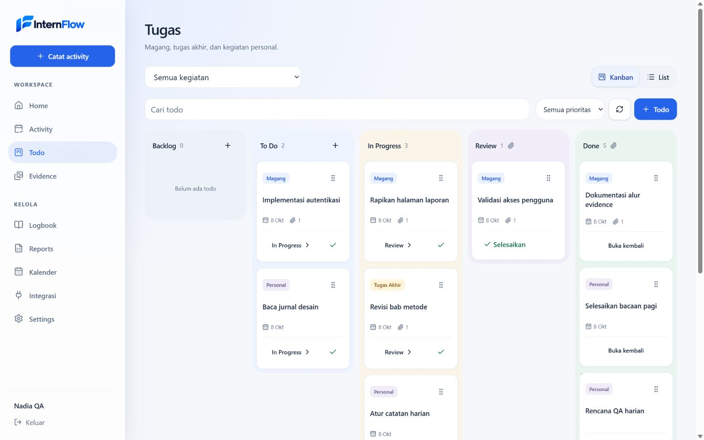
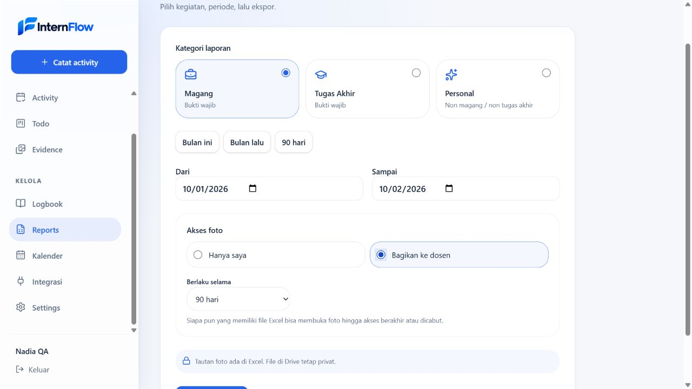
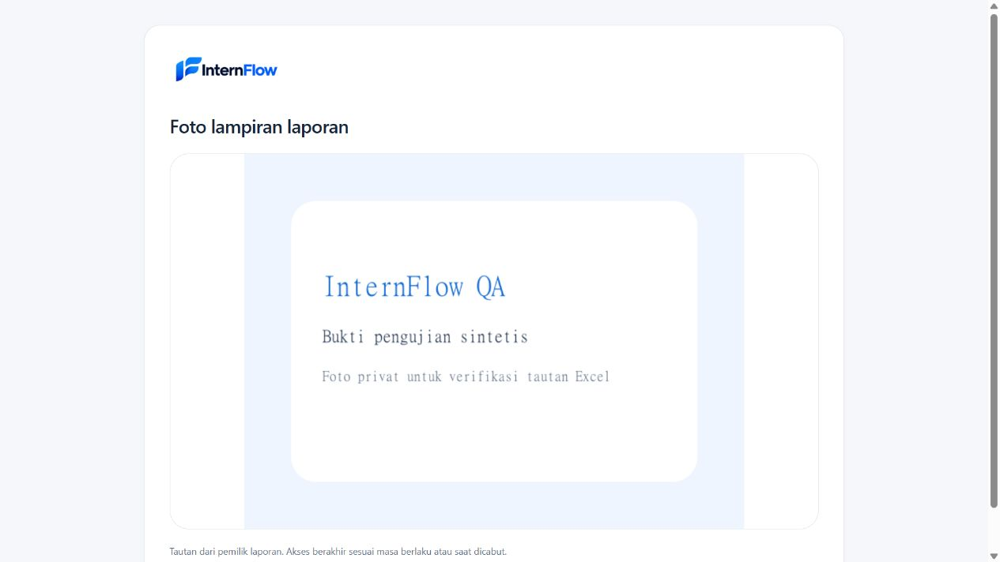

# InternFlow — Dokumentasi QA Workspace v2

Halaman ini merapikan gambar showcase dan bukti tampilan workspace v2. Setiap gambar ditampilkan sendiri agar tetap mudah dibaca pada layar kecil.

## Showcase

*Gambar showcase untuk thumbnail proyek; bukan screenshot hasil pengujian.*

## Bukti tampilan

### Beranda mobile

Beranda merangkum aksi cepat, Todo aktif, aktivitas, dan pintasan workspace.

### Kanban desktop

Board menampilkan tahapan pekerjaan dan kartu Todo dalam satu workspace.

### Laporan dan berbagi foto

Tampilan laporan memperlihatkan pemilihan kategori, rentang tanggal, dan pengaturan akses foto.

### Pembaca foto bersama

Halaman ini menunjukkan tampilan foto melalui tautan berbagi laporan.

## Catatan responsivitas

Catatan QA workspace v2 mencakup lebar layar 320, 390, 768, 1024, dan 1440 piksel. Rangkuman metode, hasil, serta batas validasi ada di [catatan delivery workspace v2](../../WORKSPACE_V2_DELIVERY.md).
